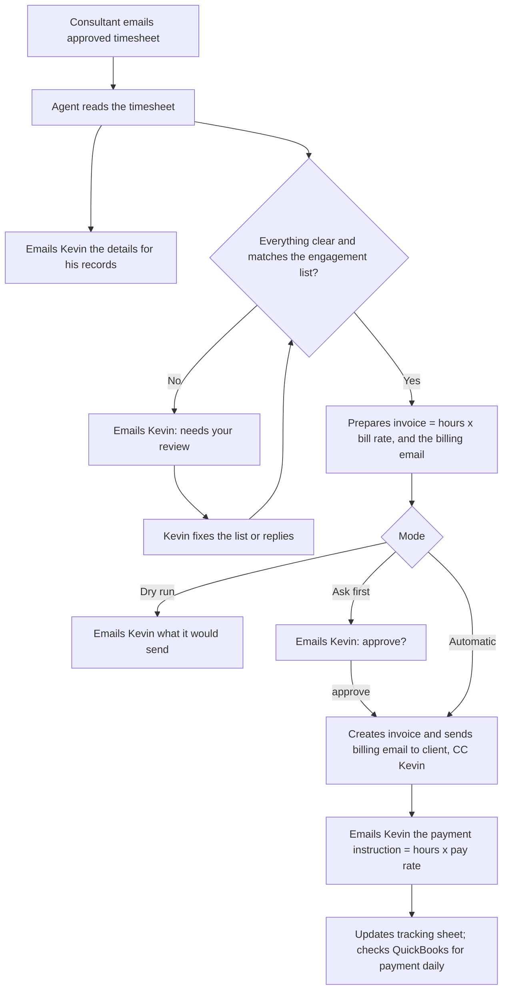

# How it works

This is the whole process in plain words. It is written for Kevin as much as for the people building the agent. The five files in `context/` describe the business itself; this file describes what the agent does with it.

## The short version

1. A consultant emails an approved timesheet to the agent's mailbox.
2. The agent reads it and works out who it is from, which client, which dates, how many approved hours, and whether the client approved it.
3. The agent looks up the engagement list for the bill rate, pay rate, billing contact, billing schedule, and payment terms.
4. The agent emails Kevin the details it found, for his records.
5. If anything is unclear, the agent emails Kevin "needs your review" and waits.
6. If everything checks out, the agent prepares the invoice (approved hours × bill rate) and emails it to the client's billing contact with the timesheet attached and Kevin on CC. Depending on the mode, it asks Kevin first.
7. The agent emails Kevin what the consultant (or vendor company) is owed (approved hours × pay rate) and when it is due. Kevin pays as he does today.
8. The agent updates its tracking sheet. Once QuickBooks Online is connected, it checks daily whether the client has paid.
9. Every Monday the agent emails Kevin a summary.

## Step by step

### 1. A timesheet arrives

Consultants keep sending timesheets exactly as they do now, just to the agent's address (for example `jay@icon-technologies.com`) instead of, or as well as, Kevin's. Attachments can be PDFs, spreadsheets, screenshots, or exports from the client's time system. The email itself might be short ("August timesheet attached") or a forwarded approval from the client's manager.

The agent checks its mailbox every 15 minutes. Emails from addresses it does not know (not a consultant, vendor, client, or Icon address in the engagement list) are set aside in a *Needs Review* folder and mentioned in the Monday summary, but never processed.

### 2. Reading the timesheet

The agent uses an AI model to read the attachment in whatever layout it comes in and pull out:

- the consultant's name,
- the client's name (and the end client, if shown),
- the first and last date the timesheet covers,
- hours per day when shown, and the total,
- whether it was approved, and what shows that (an "Approved" status, an approver name and date, a signature, or a forwarded approval email).

For each of these it also keeps the exact words it relied on and how sure it is. The model only reads; it never does the arithmetic, never picks the rate, and never decides who to email. Those parts are done by ordinary code using the engagement list.

### 3. Matching to the engagement list

The agent finds the consultant (by the sender's email address, or by the name on the timesheet) and the client (from the consultant's active engagements for those dates; if there is more than one, the client name on the timesheet decides). From the engagement row it takes the bill rate, pay rate, billing schedule, payment terms, and billing contact.

The dates on the timesheet must line up with one billing period on that engagement's schedule. If a consultant sends weekly timesheets for an engagement billed monthly, the agent collects them and invoices once the whole month is covered.

### 4. Details for Kevin's records

As soon as a timesheet is read, the agent emails Kevin what it found: consultant, client, period, hours, approval, and the file itself. This happens every time, whether or not anything else needs attention, so Kevin's records stay complete.

### 5. When something is unclear

If the agent cannot be sure about who, which client, which dates, how many hours, whether it was approved, the rate, or who to send the invoice to, it does not guess. It emails Kevin a "needs your review" message that says what it found, what is unclear, and what Kevin can do about it, which is usually one of:

- fix or add a row in the engagement list, or
- reply to the email with the answer (for example "this is for Acme", "use 152 hours", "yes, approved by Jane on the phone"), or
- reply "ignore".

The item waits until Kevin answers. Nothing is sent to a client in the meantime. The full list of reasons is in `timesheet-checks.md`.

### 6. The invoice and the billing email

When everything checks out, the agent prepares:

- the invoice: one line, "consultant — role — period", quantity = approved hours, rate = bill rate, total = hours × bill rate, due date from the client's payment terms;
- the billing email to the client's billing contact, with Kevin on CC, the invoice PDF attached, and the consultant's original timesheet file attached unchanged.

What happens next depends on the mode the agent is running in:

| Mode | What the agent does with a clean timesheet |
|---|---|
| **Dry run** | Emails Kevin the invoice and the billing email it *would* send. Sends nothing to clients. Kevin does the rest by hand. This is how the agent starts. |
| **Ask first** | Emails Kevin "Approve this invoice?" with everything attached. When Kevin replies "approve", the agent creates the invoice (in QuickBooks Online once connected; until then it just makes the PDF, and Kevin enters the invoice into QuickBooks himself) and sends the billing email. "Cancel" stops it. |
| **Automatic** | For engagements marked "send automatically" in the engagement list, the agent creates the invoice and sends the billing email without asking. Kevin is still on CC. Anything with a review item or any doubt still goes through "ask first". |

Kevin chooses the mode with one setting. The agent starts in dry run, moves to ask first when Kevin is comfortable, and to automatic engagement by engagement.

### 7. What the consultant is owed

Using the same approved hours, the agent works out approved hours × pay rate and emails Kevin a payment instruction: who to pay (the consultant, or their vendor company), the period, the hours, the pay rate, the amount, when it is due (from the consultant's pay timing), and how they are paid (bank transfer, payroll, or check). Kevin makes the payment as he does today. The agent does not track whether the payment was made and does not send reminders.

### 8. Keeping records

Every timesheet item has a status (see `status-tracking.md`). The agent keeps an Excel tracking sheet up to date with one row per item: consultant, client, period, hours, rates, invoice amount, amount owed, status, dates, invoice number. Once QuickBooks Online is connected, the agent checks once a day whether invoices it created have been paid and updates the status.

### 9. The Monday summary

Every Monday the agent emails Kevin: timesheets received last week, invoices sent, items waiting for his review, engagements with no timesheet yet for the last period, emails it set aside, and unpaid invoices when it knows about them.

## What the agent never does

- Never pays anyone or moves money.
- Never takes a rate from an email or a timesheet. Rates come only from the engagement list.
- Never invoices hours it cannot see were approved.
- Never sends anything to a client without Kevin on CC.
- Never sends the same invoice twice, and never sends an invoice for a consultant and period it has already invoiced unless Kevin tells it to replace one.
- Never guesses. When unsure, it asks Kevin.
- Never touches recruiting or candidates.

## Picture

